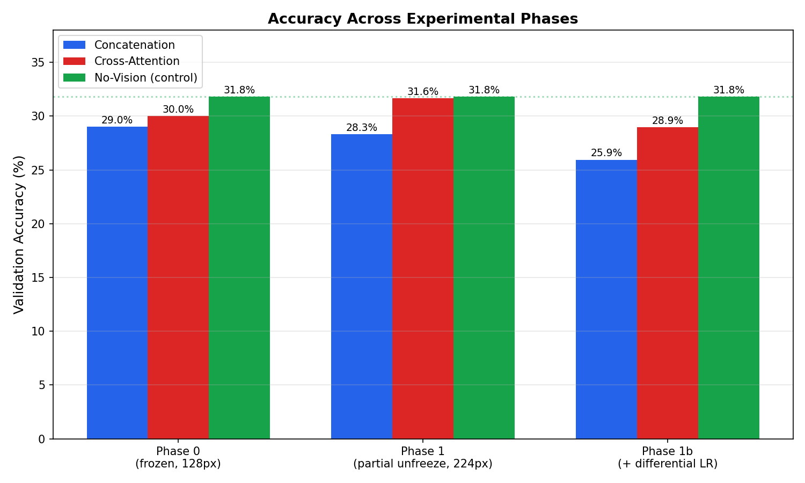

# VQA-Fusion: Multimodal Question Answering with a Custom GPT Decoder

A Visual Question Answering (VQA) system built around a **GPT-style
decoder implemented entirely from scratch** — no pretrained language
model is used. The project compares two fusion strategies for injecting
visual information into a from-scratch decoder, and includes a text-only
control baseline to verify whether the vision pathway is actually
contributing useful signal.

## Problem Statement
VQA requires a model to answer a natural language question about an image
by jointly reasoning over visual content and linguistic intent (Antol et
al., *VQA: Visual Question Answering*, ICCV 2015). Most VQA systems fuse
visual and language features using an off-the-shelf, pretrained language
model. This project instead builds and trains the language model itself
from scratch, in order to freely experiment with **how** visual
information should be fed into it.

## Novelty / Contribution
Two fusion mechanisms are implemented and compared on identical decoder
architectures, trained under identical conditions:

1. **Token concatenation** — projected image features are prepended to
   the question token sequence.
2. **Cross-attention** — text tokens attend directly to image features at
   every decoder layer.

A **text-only control baseline** (no vision encoder at all) is also
trained, following the same "language-only" diagnostic used in the
original VQA paper, to test whether the fusion mechanisms are using real
visual information or simply exploiting patterns in question phrasing.

## Dataset
A subset of **CLEVR** (Johnson et al., CVPR 2017) — 2,000 training images
(20,000 question-answer pairs) and 200 validation images (2,000 pairs).
CLEVR's synthetic, template-generated questions (counting, comparison,
attribute identification, spatial reasoning) provide a controlled,
low-bias setting well suited to studying fusion architecture in isolation.

## Architecture
```
Image ──▶ ResNet-18 (partially unfrozen) ──▶ Feature Projection ──┐
                                                                   ├─▶ Fusion ──▶ Custom GPT Decoder ──▶ Answer
Question ─▶ Word-level Tokenizer (built from scratch) ────────────┘
```

## Results

| Model | Validation Accuracy | vs. No-Vision Control |
|---|---|---|
| Concatenation | 28.30% | −3.5 pts |
| **Cross-Attention** | **31.65%** | **−0.15 pts** |
| No-Vision (text-only control) | 31.80% | — |



**Key finding:** Cross-attention fusion nearly closes the gap with the
text-only baseline once the vision encoder is partially fine-tuned
(ResNet-18's `layer4` unfrozen) and input resolution is increased,
supporting the hypothesis that a frozen, ImageNet-pretrained encoder was
poorly matched to CLEVR's synthetic visual domain. Concatenation does not
benefit the same way, likely because it only injects visual information
once rather than at every decoder layer. Full experimental analysis,
including a documented negative result (differential learning rates did
**not** improve results), is in
[`results/FINAL_RESULTS.md`](results/FINAL_RESULTS.md).

## Repo Structure
```
vqa-fusion-gpt/
├── README.md
├── data/
│   ├── clevr_dataset.py      # CLEVR dataset/dataloader
│   ├── tokenizer.py          # word-level tokenizer, built from scratch
│   └── make_subset.py        # extracts a small CLEVR subset from the full download
├── models/
│   ├── vision_encoder.py     # ResNet-18 with configurable freezing (full/partial/none)
│   ├── gpt_decoder.py        # custom decoder — supports concat / cross-attn / text-only modes
│   └── fusion.py             # wires vision encoder + decoder together
├── configs/                  # one YAML per experiment
├── train.py                  # training loop, differential LR support
├── evaluate.py                # accuracy evaluation (answer-token-only scoring)
├── analyze_results.py        # per-question-type breakdown + qualitative examples
├── notebooks/colab_runner.ipynb
└── results/
    ├── FINAL_RESULTS.md      # full experimental writeup across all phases
    └── all_phases_comparison.png
```

## Reproducing This Project

**1. Get a CLEVR subset:**
```bash
# Download CLEVR v1.0 from https://cs.stanford.edu/people/jcjohns/clevr/
# Extract into data/clevr_download/, then:
python3 data/make_subset.py
```

**2. Train (recommended: Google Colab with a T4 GPU):**
```bash
pip install -r requirements.txt
python train.py --config configs/concat_fusion.yaml
python train.py --config configs/cross_attn_fusion.yaml
python train.py --config configs/no_vision_baseline.yaml
```

**3. Evaluate and analyze:**
```bash
python evaluate.py --compare configs/concat_fusion.yaml configs/cross_attn_fusion.yaml
python analyze_results.py --compare configs/concat_fusion.yaml configs/cross_attn_fusion.yaml
```

## Base Papers
- Antol et al., *VQA: Visual Question Answering*, ICCV 2015 — [arXiv:1505.00468](https://arxiv.org/abs/1505.00468)
- Johnson et al., *CLEVR: A Diagnostic Dataset for Compositional Language and Elementary Visual Reasoning*, CVPR 2017 — [arXiv:1612.06890](https://arxiv.org/abs/1612.06890)

## Status
Core pipeline complete: tokenizer, vision encoder, custom decoder, three
fusion modes, full experimental comparison across multiple phases,
documented findings (including a negative result). See
[`results/FINAL_RESULTS.md`](results/FINAL_RESULTS.md) for the full
writeup and honest discussion of limitations and future work.
