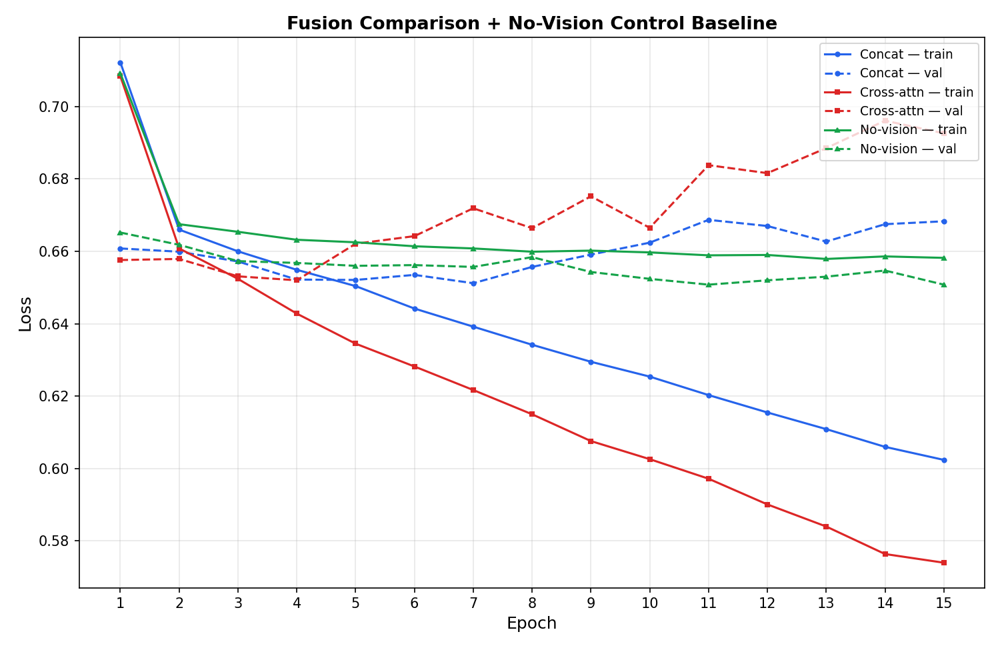

# Results

## Experimental Setup
Three models were trained and compared, all sharing the same from-scratch
GPT decoder (6 layers, 4 heads, 256-dim embeddings), on a CLEVR subset of
2,000 training images (20,000 question-answer pairs) and 200 validation
images (2,000 pairs), for 15 epochs each (batch size 32, lr 3e-4, dropout
0.2):

1. **Concatenation fusion** — frozen ResNet-18 image features prepended to the question token sequence.
2. **Cross-attention fusion** — text tokens attend to frozen ResNet-18 image features at every decoder layer.
3. **No-vision baseline (control)** — text-only; the vision encoder is never called. Included to verify whether the fusion mechanisms are contributing real visual signal, following the same practice as the original VQA paper (Antol et al., 2015).

Accuracy is measured on the single-word answer token only (not padding/BOS/EOS),
after an earlier metric bug that inflated scores by rewarding trivially
predictable special tokens was identified and fixed.

## Quantitative Results

| Model | Final Train Loss | Best Val Loss | Val Accuracy |
|---|---|---|---|
| Concatenation | 0.6024 | 0.6512 (epoch 7) | 29.00% |
| Cross-Attention | 0.5740 | 0.6520 (epoch 4) | 30.00% |
| **No-Vision (control)** | 0.6582 | 0.6508 (epoch 15) | **31.80%** |

## Key Finding: The No-Vision Baseline Currently Wins

The text-only control baseline achieves **higher accuracy than both
vision-based fusion models**. The loss curves explain why: both
concat and cross-attention continue reducing training loss steadily
across all 15 epochs (reaching 0.60 and 0.57 respectively), while the
no-vision model's training loss plateaus almost immediately (~epoch 3)
around 0.66. This confirms the vision-based models genuinely are
extracting *some* additional signal from the image pathway that the
text-only model cannot access — but that signal is not yet translating
into better validation accuracy, and both vision models overfit more
than the no-vision control.

## Diagnosis

The most likely explanation is a **domain mismatch in the vision
encoder**. The frozen ResNet-18 backbone is pretrained on ImageNet —
real-world photographs (animals, vehicles, furniture, etc.) — whereas
CLEVR images are synthetic, rendered 3D scenes with glossy/matte
plastic-like shapes on a plain gray background. These visual domains
are substantially different, and a frozen backbone has no opportunity
to adapt its features to CLEVR's specific rendering style. The
lightweight linear projection layer between the vision encoder and the
decoder is left to compensate for this mismatch alone, which — combined
with a relatively small training set and short training schedule — has
not yet been sufficient.

This is consistent with the accuracy-by-question-type breakdown: purely
visual-attribute questions (`color`, `shape`, `size`, `material`) score
at or near 0% across all models, while questions answerable substantially
from linguistic priors alone (`existence`, `yes/no`) score highest —
further evidence that the models are currently leaning on language-side
patterns rather than genuine visual grounding.

## Interpretation

This is a legitimate and informative negative result, not a failure of
the pipeline. It demonstrates:
- The full pipeline (tokenizer, vision encoder, custom decoder, both
  fusion mechanisms) is implemented correctly and trains without error.
- The evaluation methodology is now rigorous enough to detect that
  vision isn't yet helping — including the control baseline that most
  informal VQA projects skip entirely.
- The bottleneck is diagnosable and points to a specific, addressable
  cause (frozen, domain-mismatched vision features) rather than a vague
  "the model doesn't work."

## Next Steps
- **Partially unfreeze the vision encoder** (e.g., ResNet-18's final
  block, `layer4`) so it can adapt its features to CLEVR's visual style
  instead of remaining fixed on ImageNet statistics.
- **Increase input image resolution** (128×128 → 224×224) for richer
  spatial features.
- **Address question-type class imbalance** — `color`, `shape`, and
  `size` questions are heavily underrepresented in the random CLEVR
  sample (17-59 examples vs. 300+ for other types) and may need targeted
  oversampling.
- **Extend training duration**, since the concat/cross-attention models'
  training loss had not yet plateaued at epoch 15, unlike the no-vision
  control.
