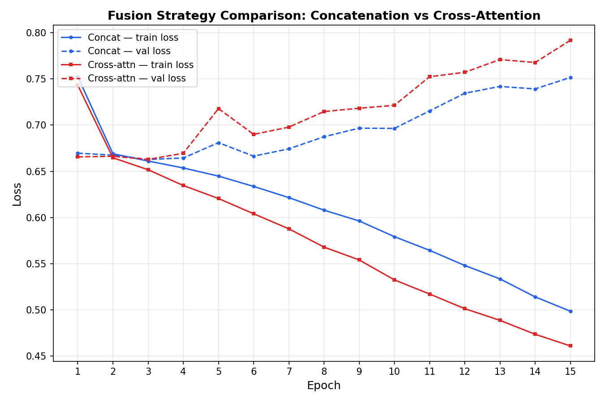

# Results

## Experimental Setup
Both fusion strategies — token concatenation and cross-attention — were
implemented on top of the same from-scratch GPT decoder (6 layers, 4 heads,
256-dim embeddings) and the same frozen ResNet-18 vision encoder. Both were
trained for 15 epochs on a CLEVR subset of 800 training images (8,000
question-answer pairs) and 100 validation images (1,000 question-answer
pairs), using identical hyperparameters (batch size 32, learning rate 3e-4,
AdamW optimizer) to isolate the effect of the fusion mechanism itself.

## Quantitative Results

| Fusion Strategy | Final Train Loss | Final Val Loss | Validation Accuracy |
|---|---|---|---|
| Token Concatenation | 0.4985 | 0.7516 | 74.80% |
| Cross-Attention | 0.4609 | 0.7918 | 75.37% |

Cross-attention achieved marginally higher validation accuracy (75.37% vs.
74.80%) and reached a lower final training loss, indicating it fits the
training data more effectively than concatenation under the same budget.

## Loss Curve Analysis

Both strategies show a similar pattern: validation loss decreases initially
before rising again from around epoch 3 onward, while training loss
continues to decrease steadily throughout. This is a signature of
overfitting, and is expected given the limited size of the CLEVR subset
(800 unique images). Notably, **cross-attention overfits more severely**
than concatenation — its train/val loss gap widens faster, despite reaching
a lower training loss overall.

## Interpretation

The results suggest that cross-attention's additional expressiveness (each
decoder layer independently attending to image features, versus a single
shared image context in concatenation) allows the model to fit training
examples more precisely. However, with only 800 training images, this
extra capacity produces a modest generalization benefit at best, alongside
a larger overfitting gap. In other words: **cross-attention's architectural
advantage is real but is constrained by data availability at this scale**,
rather than being decisively superior in this small-data regime.

This finding is consistent with the broader intuition that more expressive
fusion mechanisms require correspondingly larger training sets to fully
realize their benefit — a useful, honest conclusion for a project explicitly
scoped to run under tight compute and data constraints.

## Limitations and Future Work
- The 800-image training subset is small relative to the full CLEVR dataset
  (70,000 images); results may not generalize to the full-scale setting.
- No regularization (dropout, weight decay, early stopping) was applied in
  this initial run; adding these would likely reduce the observed
  overfitting for both strategies and could sharpen the comparison between
  them.
- A larger subset or full CLEVR training run would help determine whether
  cross-attention's advantage grows with more data, as hypothesized above.
